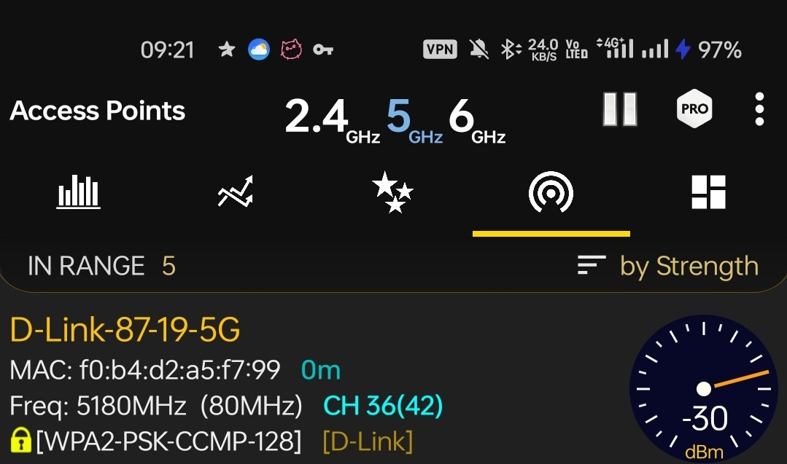

### **Отчёт по лабораторной работе № 1**
**Цель работы:** Установить анализатор WiFi сетей. Познакомиться с основами его работы и произвести перестройку оборудования.

Для выполнения работы на мобильное устройство было установлено приложение WiFi Analyzer. Данное ПО предоставляет информацию о WiFi сигналах и помогает проанализировать мощность сигнала, используемый канал и использование полосы пропускания.
С помощью приложения было проведено сканирование доступных WiFi сетей в двух диапазонах: 2.4 ГГц и 5 ГГц .
  

**Сколько источников сигналов вы видите?**
В диапазоне 2.4 ГГц обнаружено 15 источников сигнала. В диапазоне 5 ГГц обнаружено 5 источников сигнала. Итого в зоне досягаемости находится 20 точек доступа.

**Какой канал и в каком диапазоне самый загруженный?** 
Наиболее загруженным диапазоном является 2.4 ГГц. Это связано с тем, что для передачи данных используется 14 каналов, которые частично перекрываются. Самая высокая плотность сетей наблюдается в правой части спектра — на каналах 9, 10 и 11.

**Сколько источников сигнала в одном с вашим роутером канале?**
Исследуемый домашний роутер (D-Link-87-19) в диапазоне 2.4 ГГц работает на 9 канале. На этом же канале, а также на пересекающихся с ним частотах, вещают еще около 6 сторонних сетей. В диапазоне 5 ГГц роутер (D-Link-87-19-5G) работает на 36 канале и частично пересекается с 2 другими сетями.

Были произведены замеры мощности сигнала от домашней точки доступа.

.jpg)

Для сети 2.4 ГГц мощность сигнала составляет **-29 dBm**.
Для сети 5 ГГц мощность сигнала составляет **-30 dBm**.

Данные показатели свидетельствуют о максимально высоком и стабильном уровне сигнала.  Замеры производились в непосредственной близости от точки доступа, но картина в пределах квартиры одинаковая. Экспериментировать с местоположением роутера для улучшения мощности не имеет смысла.
